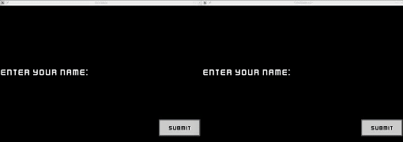

# DiceGame

This is a working protoype of a networked Qwixx clone.  There is more needed to be done to make
network communication more robust, but it is 
currently possible to successfully play the game with remote players.

### Clips

### Goals
This project was started for these two main goals

- Implement a networked version of the dice game Qwixx to play
with friends and family during the coronavirus lockdown
- Learn/practice modern software development tools and techniques e.g.
  1. Use CMake for the build system to make cross platform (Linux, Windows, Mac) building smooth
  2. Use conan for package/dependency management
  3. Writing unit tests with Catch2

### Current Network Architecture
The game currently uses SFML for networking.  Messages are sent through the `SFML::Network::Packet` class
by overloading `operator`'s `<<` and `>>`. 

Initially the server
sets up a TCPListener and adds clients, making the first client the host.  
Clients can submit there name and when the host sets "Ready", the game starts.

At the end of the game there is an option to replay, and again the host is the 
authority on when the game should restart.

### Planned Improvements (currently on hold)
- Move to `asio` networking library, add a lobby system, and handle disconecting more gracefully
- Move to SDL2 for graphics, add options for window resolutions/rescaling

